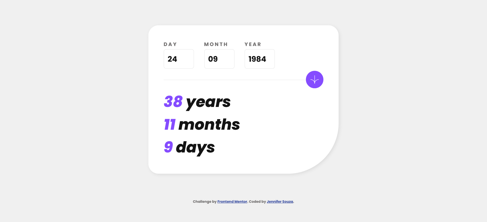

# Frontend Mentor - Age calculator app solution

This is a solution to the [Age calculator app challenge on Frontend Mentor](https://www.frontendmentor.io/challenges/age-calculator-app-dF9DFFpj-Q). Frontend Mentor challenges help you improve your coding skills by building realistic projects. 

## Table of contents

- [Overview](#overview)
  - [The challenge](#the-challenge)
  - [Screenshot](#screenshot)
  - [Links](#links)
- [My process](#my-process)
  - [Built with](#built-with)
  - [What I learned](#what-i-learned)
  - [Continued development](#continued-development)
  - [Useful resources](#useful-resources)
- [Author](#author)

## Overview

### The challenge

Users should be able to:

- View an age in years, months, and days after submitting a valid date through the form
- Receive validation errors if:
  - Any field is empty when the form is submitted
  - The day number is not between 1-31
  - The month number is not between 1-12
  - The year is in the future
  - The date is invalid e.g. 31/04/1991 (there are 30 days in April)
- View the optimal layout for the interface depending on their device's screen size
- See hover and focus states for all interactive elements on the page

### Screenshot

### Links

- Solution URL: [https://github.com/zoedarkweather/age-calculator-app](https://github.com/zoedarkweather/age-calculator-app)
- Live Site URL: [https://age-calculator-app-mauve.vercel.app/](https://age-calculator-app-mauve.vercel.app/)

## My process

### Built with

- Semantic HTML5 markup
- CSS custom properties
- CSS Grid
- Mobile-first workflow
- JavaScript

### What I learned

I learned that working with dates in JavaScript is more challenging than I'd anticipated. Date() has some unusual behavior. For example, any date that is 31 or less is accepted and made to be a date in the following month. For example, if April 31 is given to Date() it will return May 1 rather than invalid date. Also, months are zero-based, but if you give Date() a string in the format "MM/DD/YYY" you don't need to adjust for that. If you feed it integers, it doesn't always return the expected date even if you account for the zero-based months.  

### Continued development
 
 Keep practicing everything. Also, play with dates in JavaScript more - I feel like I'm at least expecting some strange behavior from Date() now, but I'd like to learn some more tricks in dealing with this.

### Useful resources

- [https://stackoverflow.com/questions/21188420/javascript-date-validation-not-validation-february-31](https://stackoverflow.com/questions/21188420/javascript-date-validation-not-validation-february-31) - This helped me resolve the anything 31 days or less is a valid date issue.

- [https://stackoverflow.com/questions/12254333/javascript-is-creating-date-wrong-month](https://stackoverflow.com/questions/12254333/javascript-is-creating-date-wrong-month) - This helped me learn that months are zero-based and how to get around that.

## Author

- Github - [Jennifer Souza](https://github.com/zoedarkweather)
- Frontend Mentor - [@zoedarkweather](https://www.frontendmentor.io/profile/zoedarkweather)

